# 十二神器——究竟是什么作品有资格成为神器

> 欢迎来kun的galgame交流群玩耍， https://t.me/kungalgame ， qq群：726477957

## 前言  

神器的来源最早应该是galgame吧吧友所说的“三神器”（较高的可能性是“冲绳奴隶岛”“妹调教日记”“沙耶之歌”）

十二神器的概念是由**原galgame吧吧主冷酷的K**根据吧友所说的游戏里挑选扩充而来的十二款游戏，但是由于某种原因在galgame的圈子中广为流传，我们可能都见过这张图

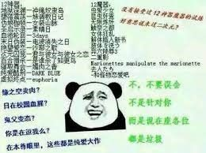

（个人的galgame龄并未接触过那个时代的事情，所以**以上内容均为互联网搜集整合而来**）

  

- 然而这里的**神器不等于神作**，所有的**神器里都含有可能令新人感到不适的因素**，诸如NTR、猎奇、精神污染、男铜、男娘等。十二神器超越伦理，十二魔器超越种族
- 大部分的人会选择使用十二神器坑害萌新用（坑的是伸手党），实际上大多数时候他们自己都没有玩过。  仔细想想朋友们你们有多少人是沙耶之歌入坑的
- **但是所谓的质量差并不能一概而论，经过我打完所有的十二神器，个人觉得神器里还是有很值得一推的作品的**
- 十二神器的作品大多数年代集中于2010年左右，所以在画质和与现在的游戏会产生脱节，与现在的某些生活场景也会有所不同。
- 后来也有一些作品可以称之为“神器”甚至超越神器，比如有人提出了将现有的神器做出改变，将诸如“濒死轮回的卿于馆中萌生的憎恶”“魔法少女的哥哥”等加入十二神器，甚至替换。

但是流传了这么多年影响力也不是一点半点，所以就不可能有所变动了。

但是，再怎么说神器也带有个“神”字。
  
这次，就让我们一起来见识一下十二神器“神”在哪里？

“次元囚笼”“血池轮回”“虚拟终点”这些称号究竟是怎么命名出来的？

十二神器，究竟是讲了个什么故事？

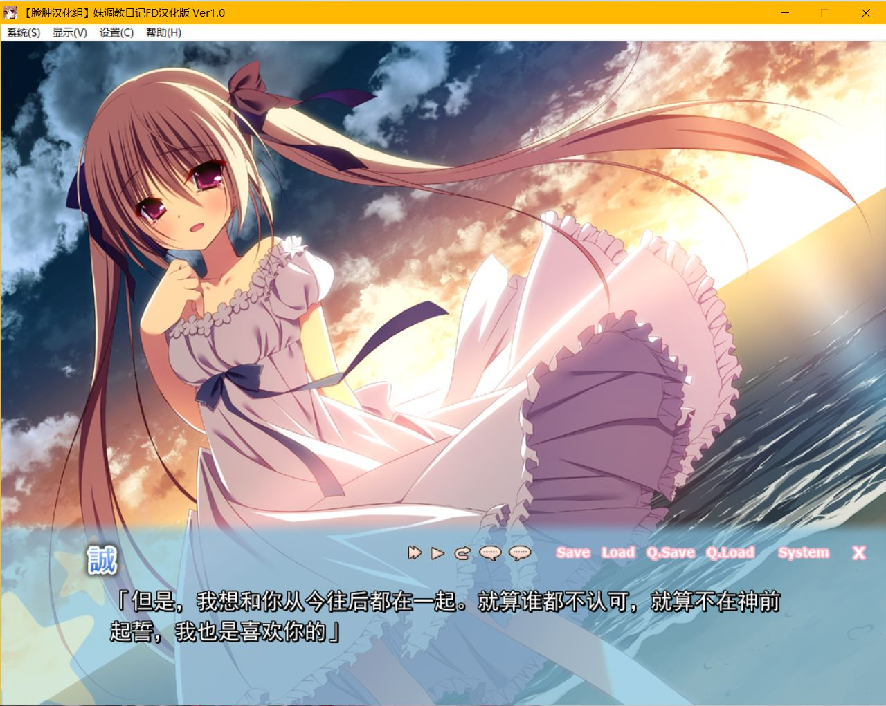

**由于本人这次是第二次推，所以观感可能与第一次推有所不同**。

### 1. 血池轮回——3days

#### 游戏说明：

本游戏属于穿越、**轮回**、魔法、战斗、**血腥猎奇**（可避免）、连环杀人**、NTR**（其实牛的不深，因为打完了仔细想想才会发现这个游戏是有牛的）、精神循环类的作品，**并不适合新人游玩**。如果您觉得对猎奇杀人、精神冲击、循环轮回已经具有一定抗性的话，请您务必尝试一下本作品。
#### 建议及BUG处理：

游戏的主界面有是否开启血腥限制模式的选项，**建议不喜欢猎奇只是想要体验游戏的朋友们关闭**，如果您想体验原汁原味的情节，那么可以开启

#### 游戏前言：

故事的舞台綾篠市自古作为城下町而一直繁荣。

明治維新后，随着现代化的推进，其纺织工业逐渐兴盛。

由于其地处由山围成的盆地，对周围区域来说，是交通，商贸往来的重要城市。

市中心的綾篠公園是一个自然公园由篠蔓之池这样一个大块水域围成。是市民休憩，约会的重要场所。

公园旁边的小山上是男女主人公上学的綾篠学園。据传说其建校时间为明治31年，有着悠久的历史和传统。其前身为基督教名门女子私立学校。

随着市内人口增加，政府为满足生源需要，故改变其经营模式，改建为普通公立学校。其体制也改为男女混合学校。

主人公「高梨  亮」目前住在綾篠公園旁綾篠学園后方的大型住宅区域内。

美丽、和谐的城市生活中，暗藏着不安的阴影:美少女「柊　美柚」的尸体被发现，从綾篠学園楼顶上逝去的生命「吾妻　梨花」。

为了结束在这一城市中发生的惨剧，结束这一无休止的噩梦。故事就这样开始了。

#####  极多的选项支

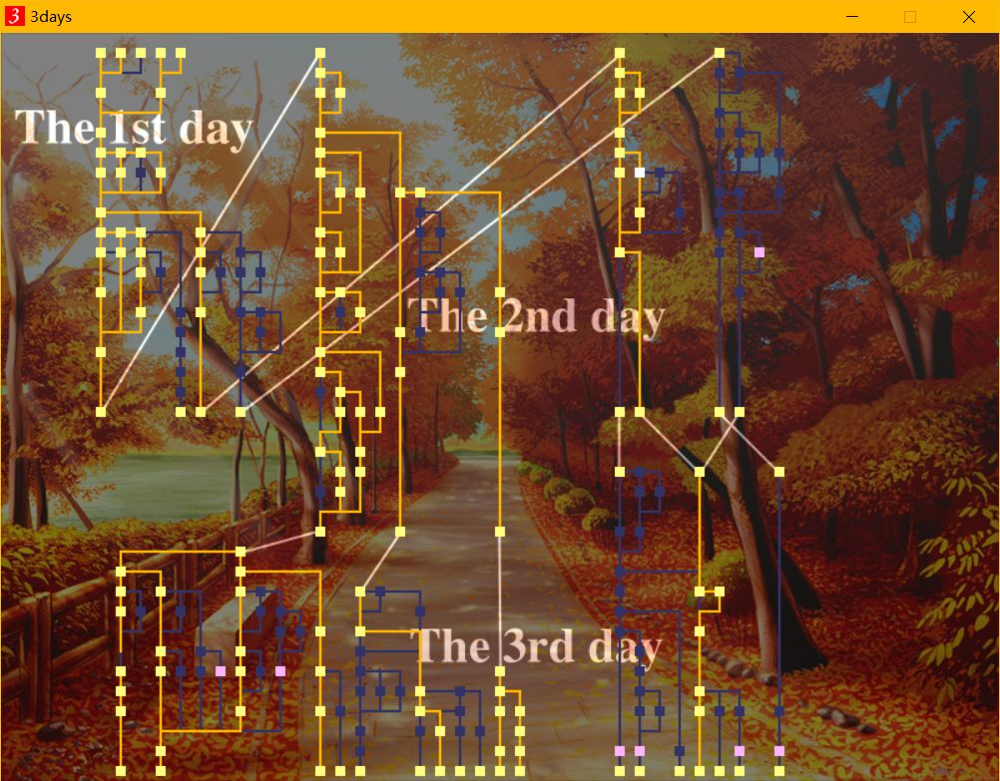

####  我个人的一点感想：

不管是魔法还是轮回，是极度的罪恶还是极度的无动于衷，我是一个孤独的人啊！我仅仅只是想找个人说说话而已！

所以，美柚，我需要你！请和我说更多的话吧，无惧轮回、无惧死亡

生命力耗干的我，为你所救。

**因此，我将献上我的一切，弥补你所失去的轮回！**

### 2. 纯爱酷刑——Dark Blue

讲真的我个人非常不愿意讲这部游戏，这是**我玩gal以来记忆中唯一一个被气哭的游戏**，真的是纯爱酷刑。。。一点都不假

但是，这是三年前！还年轻的我很惨的被牛了！

如今**第二次打这部游戏，历经重重选项，到达了唯一一个Happy End！**

我很开心！

***本游戏属于NTR、NTR、NTR***！猎奇杀人、悬疑、**类的游戏，请各位hxd们有足够的牛的耐性后再来。

（比如只是妹调中那种**程度的）

但是如果你只是想通一遍Happy End体验游戏剧情的，那么请你好好的玩一遍这个游戏，因为**不仅不会有任何超过拥抱程度的NTR，相反还非常甜**。

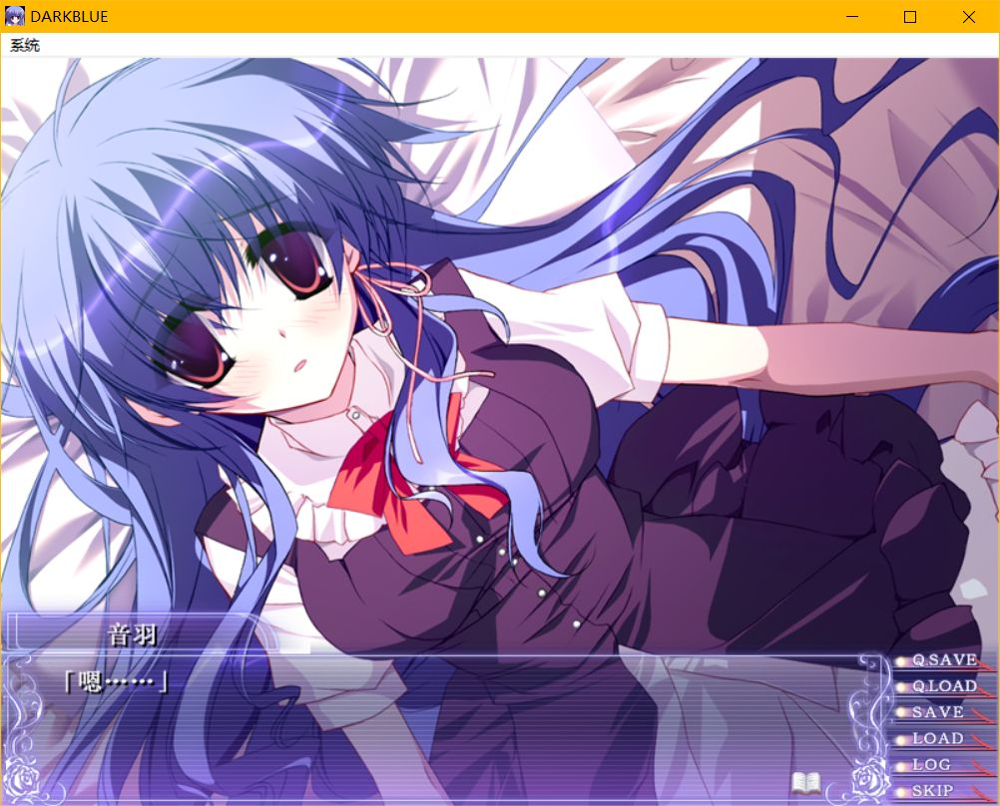

不知道有没有看过Dark Blue里番的朋友，可否对这里很熟悉
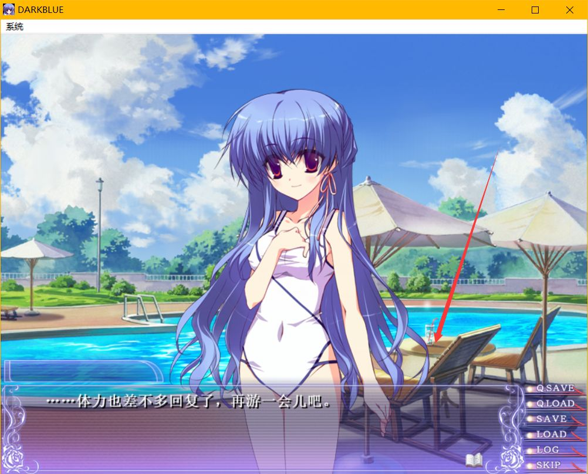

#### 游戏前言：

主人公一行人去旅行，而落脚点就在伊能的一栋洋馆。

原本看似休闲的旅行，结果当晚就发生了惨剧。琴美在餐厅被人杀害。但是奇怪的在于脸上的表情却很平静。

由于洋馆在偏远的地方，加上天色已黑，所以当晚根本无法离开，加上从管家处得知附近发生了山体滑坡，而且新闻里说道附近地区有一个潜逃的杀人犯在逃。

所以众人最后决定还是留在这里，第二天再报警。

而第二天早晨，又在音羽的房间里发现了双子的尸，而且是被各切下一半，然后缝合在一起。看来凶手很有可能就在附近，甚至潜伏在房子里了。然后ほのか给了主人公一把万能钥匙，可以开启大屋里所有的门，希望他帮助调查。

主人公能够顺利的找到凶手吗？

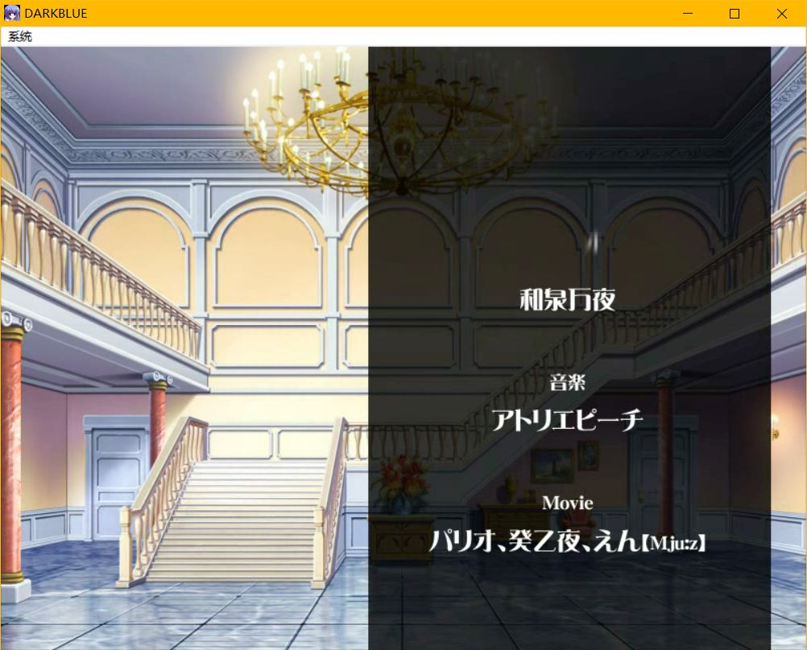

### 3. 堕落震荡——妹调教日记

**本游戏含有NTR**、凌辱、露出、恶堕、校园欺凌、血腥等要素。玩游戏之前请确保有一定抗性。

  
**游戏包含两部：妹调教日记以及妹调教日记FD**

其中妹调教日记仅有一个Happy End，以及一个Normal End，其余三个均为Bad End。

而妹调FD中没有坏结局，只有一个和妹妹的结局以及一个后宫结局

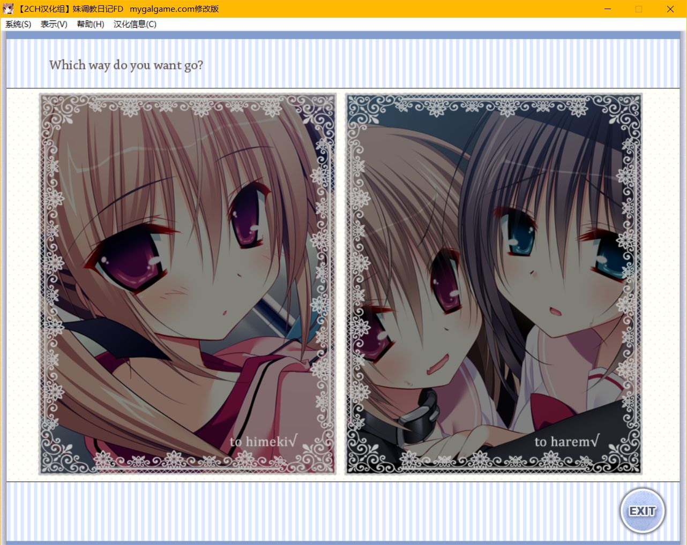

这是一个发生在喜欢妹妹却不自知的死宅哥哥与傲娇妹妹之间的故事。

一之濑诚是个宅男大学生，他有一个每天打他起床令他无比讨厌的妹妹——一之濑姬月，但他不知道的是，从小时候起的某次事件后他的妹妹便对他暗生情愫。

看到哥哥长大后不断的宅化，玩Hgame，姬月渐渐开始焦虑，讨厌哥哥不关注她。

在一次偶然的碰面中，姬月发现自己的好友樱穗乃香似乎对自己的哥哥心存好感，感到爱情危机的姬月为了阻止哥哥与好友交往，决定主动请求哥哥的调教从而让哥哥不对好友出手。

于是，御宅族哥哥与傲娇妹妹之间各种各样的事件即将发生。

对妹妹爱护不够的话，妹妹会被你玩坏的哦。如何当个好哥哥，这个问题就留给玩家们在游戏中自己思考吧。

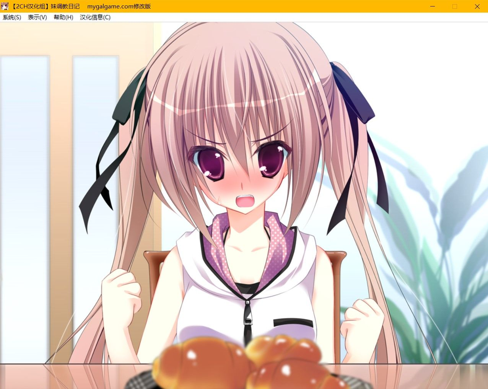

#### 作品特点：

##### **甜中夹雷，猝不及防**

十二神器广为人知所以提前做好了准备，但是我们反过来想想，如果我们第一次玩这个游戏，明明是一个看着日常的傲娇妹游戏，突然就牛啊柴刀等等，确实会令人难受很久的

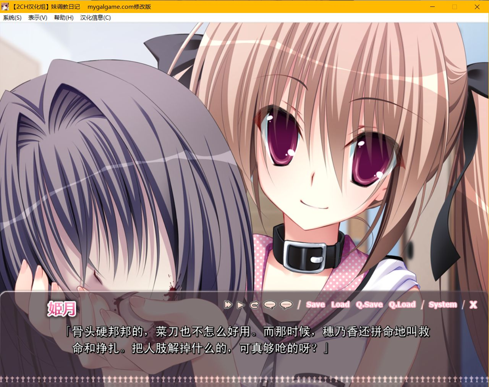

### 4. 伪娘枷锁——女装山脉

脑内彼女，主要作品有女装三部曲（女装山脉、女装海峡、女装学院）等，总之现在在网上流传的大多数“名字里有女装的作品”，都是这个社做的。

从他们的做事中我只看出了这样的想法：男娘无处不在，男人与男娘之间可以恋爱。。。

**我想提供一款快乐的，有味道的软件。**

**请多多关照。**

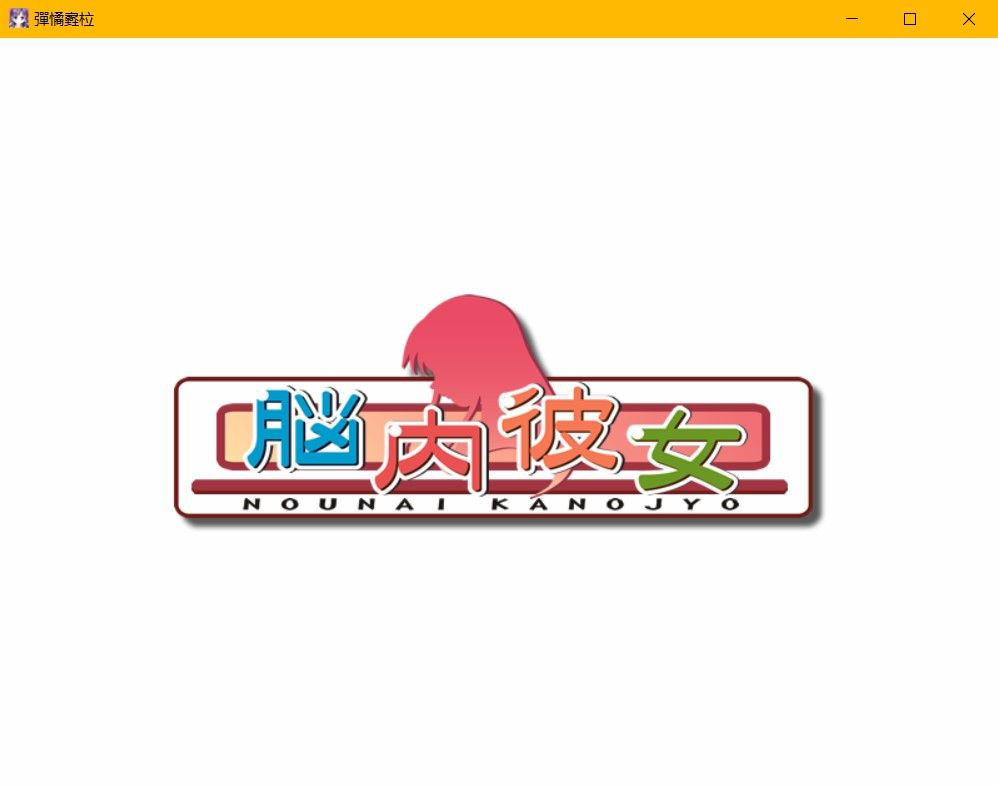

这是某个文明尚未开化的小山村。数百年前，众多的年轻男子因为感染了村中的疫病而死去。村子一度濒临绝后。

自那以来，为了防止疫神带走年轻人的性命，村中便有了让男孩子穿着女子服装的习俗。

之后，时间到了现代。

村中仍旧遵循着这项习俗。女主角们作为女孩子成长，从未被教导过身为男性该怎么做。

误入村中的主角竟是女主角们第一个接触到的外界男性。

从未见过男性的女孩子们对主角很是感兴趣，纷纷积极地追求起主角。

村人们见主角穿越隧道而来，便当他是传说中神的使者，热情地款待了他。

一场豪雨导致了泥石流，公路要在一个月后才能修好。主角只得被困在这座陆上的孤岛之中。

村人们劝主角留在村中，并提议不如同村中的女子结合，定居此地。

主角性格腼腆，甚至无法同女孩子聊天。神奇的是，他却能自然地同村中的女孩子们相处。

在这村娶妻生子，安度一生，似乎也不错……

然而，主角的这一美梦似乎是无法成真了。

#### 我在这里讲一下故事大概的剧情：

  

首先，男主在山中迷路了，进入了一个村庄，然后被几个伪娘所救

（**这部作品个人觉得没有什么剧情含量**所以就直接剧透了）

看，多可爱？！接下来，机缘巧合之下，我们的男主突然发现

#### **Surprise？！（掏出来比你都大）**

于是我们的男主和这群伪娘们快乐的生活过日子，日久生情。。。

**然后生了孩子！**

什么？你问为什么会生孩子？！
#### 这里作以解释：

很久很久以前，这群伪娘们居住的村子里发生了一场大瘟疫，女人们都相继去世了。

于是产生了一个问题：后代该如何延续？

于是这时候出来了个严神（就是神），**他让村民们中的一部分男人穿上女装，担任起女人的责任，并给予他们生育的能力**，此等有违天理的事情，导致了村子的延续，也造就了女装的形成。
#### 我个人的一点感想：

**男娘真可怕。**

### 5. 百合猎杀——是谁杀死了知更鸟
  
本游戏含有百合、**病态爱恋**、犯罪行为、**多人**、致郁等可能引起人不适的情节，请各位认为对此有一定抗性的朋友游玩。

（个人认为这一部的恶心人程度完全比不上其它几部 *可能因为不控百合 *）

スマイル戦機，目前就我个人所知这个社团就做了这一部作品，2Dfun和VNDB上也没有什么踪影，因此这里不做评价

> 是，是谁杀了知更鸟?
> 『是我』,麻雀说。
> 用我的弓和箭杀死了知更鸟。
> 是，是谁看着知更鸟死去?
> 『是我』,苍蝇说。
> 用我的小眼睛看着知更鸟死去。
> 
> 是，是谁接住了知更鸟的血?
> 『是我』,鱼说。
> 用我的小碟子接住了知更鸟的血。
> 
> 是，是谁杀了知更鸟?
> 『是我』,我如此回答道……

**想要毁掉一个人是何等的容易**，家庭阴暗，生活无光，周遭恶语，连自己的房间也被装上了监控。

就好似那男主说的一般，笼中之鸟，可怜又无助。

折断它的翅膀，抽下它的筋骨，束缚它的精神，屈服。。。

不顾那苟延残喘的哀嚎！

但是！

女主最后说了什么呢？

女主真的屈服于男主说出了爱男主了吗？！

不！没有！！！

  

请注意，在这句话的前面，女主还说了两个字：

我不禁莫名的想到了海明威的一句话：一个人并不是生来要给打败的，你尽可以把他消灭掉，可就是打不败他。

同样的，这里让我见识到了这对**硬汉般的百合之恋**。

### 6. 虚拟终点——euphoria

本游戏包含大量**暴力、重口调教、多人**、精神疯狂以及**部分血腥猎奇**场景，请具有一定忍受力的朋友们进行游玩。

请对钟表社作品没有一定认识的朋友们**关闭“脏东西”的选项**，我个人觉得这个设定就是恶心人的。。。

但是如果有hxd想要打开这个选项，也没有什么大问题，有可能会被恶心到而已

如果有胆小的朋友或者一些实在想试试水的新人，可以尝试把“显示恐怖的东西”和“显示阿黑颜”都关闭

#### 游戏前言：

在模糊间醒来的主人公惠辅，发现自己躺在一间白色的房间，密室的门上有亮着的绿灯。

主人公推门而入，在另一个的白色房间发现同样被带入这个奇妙空间的人，青梅竹马的帆刈叶、班长安藤都子、学妹莳羽梨香、英语老师葵菜月、同年级的白夜凛音、与同班同学真中合欢。

没有人知道为什么自己会来到这。

突然的系统广播表示；“这是场游戏，参加者共有七名，主人公是钥匙一名，而女角们是锁孔六名。

游戏要求参加者以游戏指定的方法开锁，锁孔则是女角们的私密部位，现在参加者可以选择退出或者是进行游戏。”

这样的条件让一向古板的班长当场发火，表示要退出。

在系统确认之后，灯光突然的暗了下来，当恢复光亮时，众人发现班长被绑在拷问装置上，然后在椅子上凄惨地被电死了，这样的可怕结果让人没有选择退出游戏的余地。

在主人公观察班长的遗体时，真中合欢发现了主人公惠辅不正常的性癖，在合欢公开其性癖的胁迫下，迫使主人公立下契约之吻。

为保护青梅竹马叶，以及逃出这个白色的空间，主人公与女角们被迫依系统指示，进行开锁。

#### 难道这就是真相吗？

本作最大的一个特点就在于解谜。

从一开头的被关在一个密室里，就开始诱导玩家：

为什么，为什么会被关起来？

而之后的一系列剧情设置，都让玩家觉得混乱：

什么是真的？什么是假的？我是谁？而我又应该怎么选择？

#### 我个人的一点感想：

不知为什么写不出感想来，可能是因为白夜凛音的原因吧，她。。她实在是太惨了

被当作RBQ，最后连完整的身体都不剩了

总之钟表社的游戏感觉难以说出什么话来，可能是**对人性黑暗的行为刻画过于直接了**，打第二遍打的我也挺无言的。。

### 7. 地狱深渊——重生萝莉岛

略。。。

#### 我个人的一点感想：

没什么想说的，谁玩谁 * * 

### 8. 末日伪装——电波消逝之日

本游戏包含一定的NTR（你牛别人？）、妹杀、小幅度电波以及 **一处血腥场景**。

（其实任何人都可以玩）

十二年前，太阳系出现一颗新的彗星。那颗彗星远比其他的彗星巨大，在地球最接近该彗星时，彗星的磁场会引发大规模的电磁波通信干扰。

这段时间全球都会受到电磁波干扰的影响，电磁通讯会中断，电视无法接收电波信号而画面呈现砂岚状态，因此被称作“电视机消失之日”。

在地球受到磁场干扰期间，主角美作慎吾的父母因飞机失事而遇难。

通过偷听父母同僚的猜测，主角意识到是父母的上司穂坂健一利用电波障碍引发了飞机失事，让慎吾失去他的家人。

那一年，慎吾发誓要对穂坂健一进行报复。

12年后，当慎吾在进入高中就读之后，偶然与一个新生相遇。

她就是杀害慎吾亲人的穂坂健一的爱女——穂坂七海。

慎吾决定以她作为报复穂坂健一的手段，一段扭曲而惨痛的历程随之展开。

当谎言和记忆交错之时，失去爱的痛苦的人类，想要找到自己存在的真正意义

**希望这个世界上的家庭都幸福吧，不要再有不圆满的家庭和不幸福的妹妹了**

### 9. 圣启示录——素晴日

> 来自小站站长**真红**的额外提醒批注：素晴日一定要玩，没玩过的不能说自己是galgame玩家。（不过好像还是不能手机玩）

美好的每一天 ～不连续存在～（素晴らしき日々 ～不連続存在～）

总是被称作素晴日是因为其日语名里带有“素晴日”三个字，就像在动漫中“素晴”一般指的是《为美好的世界献上祝福》

#### 游戏说明：

本游戏包含大量电波、**校园欺凌**、多人、**恶趣味调教**、无端恐惧、精神哲学、**Futa与男、精神妄想**、人格分裂、克苏鲁文化以及少量的猎奇画面，请诸位朋友具有一定的心理承受力后再来。

**剧透：众多玩家一直在提的精神污染源指的是两名男同学强迫一名男同学穿上女装后对其实施****

#### 游戏提醒：

这里如果你是一名真正的勇士，经历过了萝莉岛的洗礼（我就打了5分钟啊kora!!!），那么我可以很自豪的告诉你，看了精神污染场景之后毫无感受（实际上还是挺。。。）

这里如果你是一名对于3D业界有所了解的，经历过例如ATD大师或是一些欧美3D大师作品的洗礼，那么之后的Futa场景你也将如履平地（我不是变态啊kora!!！）

**本游戏包含大量的电波以及一些莫名的数学、哲学、美学、心理学观点** ，实际上对于游戏进度的理解没有太大的影响，看不懂就看不懂吧。。

（这使得游戏的整体感觉非常茫然，我打第二遍完了还是感觉写不出来东西）

水上由岐捡到了从天上掉下来的布偶。

而那个丢下布偶的少女 —— 高岛柘榴说:

“这是为了回到天上的那一天而做准备”

从那一天开始，由岐和青梅竹马的若槻姊妹，及高岛柘榴

一同前去寻找“天空少女”与“世界少女”相遇的地方 ———

水上由岐被才刚刚遇见的少女 —— 高岛柘榴给吻了。

少女说 ——“接下来会发生很不得了的事情喔!”——。

次日学校里不安的气氛随着一个传闻在流窜著。

“听说高岛柘榴自杀了!”

从那之后由岐的日常渐渐地偏离了。

向着“终之空”一一 点一点地偏离过去 ———

**间宫卓司**

御宅族，精通动漫和漫画，胆小怕事，生活自闭，**有严重的妄想症，经常在学校被欺凌**。

设定是“救世主”，实际上是自己妄想的

（**就是开头讲到的校园欺凌被女装的男生**）

在下水道之间的空层搭建了属于自己的秘密基地

**高岛柘榴**

第三章的主角，小心谨慎，话语较少，为人温柔，在学校被欺凌。

与外校的两名同学一起研究“螺旋马太”，说白了就是妄想

（“螺旋马太”实际上说白了就是跳楼。。）

**间宫羽咲**

妹妹（她究竟是谁的妹妹呢？），天真可爱，喜欢兔子玩偶，同样会武术，可以轻易的制服一个成年人，表面柔弱实际上有自己坚强的一面

（这兔子玩偶老想着穹妹。。实际上的确有H场景）

**音无彩名**

知识量巨大，神秘少女，经常出现在屋顶，或者悄无声息的人出现在任何可能出现的地方。

几乎所有出现的事件中都有她的身影，被玩家们称作“旁观者”的存在。

性格琢磨不定，经常会露出莫名的微笑。

  

在某人的妄想中会变为Futa，知晓一切的存在，称利露露只是其一缕化身而已

（伏行之混沌。。。吗？这又是哪位古神！）

这里放一张素晴日里奇怪的图片，咱啥也不敢说，咱也不敢问

首先就是整部作品，打完之后感觉非常空虚，个人认为肯定是作品中大量我不理解的话造成的原因，把一切真相都见识了一遍，等到自己写的时候却一个字都写不出来

综上，这部作品的剧情我几乎是处于一种很懵的状态，剧情串联不起来，所以在此基础上说出一些看法

打了向日葵的坂道后，对由岐姐，间宫皆守和卓司这一组挺感慨的，说不上来的感觉，我肯定也没有玩明白这个作品吧

还有就是间宫羽咲，妹妹，又是妹妹。。。

哥哥姐姐们打架妹妹受伤，最后还要连累，家庭不圆满，生活自闭，与此同时还要自己坚强的生活下去，同时还得操心自己的哥哥

这里真的感觉人妖（水上敏夫）做的很好！

**愿天下的妹妹得到幸福！**

### 10. 绝望爱恋——沙耶之歌

本游戏含有大量**内脏猎奇场景**、触手、**NTR**等场景（有NTR的CG描写），请对内脏感到不适的朋友们量力而行。

（实际上我认为这不算是真正的NTR，因为可以看作怪物，然后**男主纯爱战士一菜刀砍死了牛哥**）

医科大学生匂坂郁纪遭遇了一起严重的交通事故，双亲身亡，幸运的是他活了下来。

经过脑外科手术后，郁纪苏醒了过来，但他却发现原本熟悉的世界变成了另一幅模样。

他眼中的世界变成了到处都是内脏和腐肉的恐怖世界，人们看上去就是会移动的肉块状怪物，大家的话语则变成了怪兽一般的声音，连平常的食物在他眼中也变得令人作呕。

然而，在郁纪绝望之时，他却遇到了他的世界中唯一正常的存在——谜一样的少女“沙耶”。

她是寻找她的父亲而来到这个医院。

经过多次的见面和交流后，郁纪对沙耶产生了爱意，觉得她是可以让他忍受活在这个病态世界中的理由，从而邀请她到自己的家里，开始在一起生活。

然而，这仅仅只是刚踏入通向真正到来的疯狂的门扉而已。

故事主要讲述了郁纪和沙耶之间的纯粹却又另类的爱情故事。

**沙耶**

少女（萝莉？），只有在男主眼中是美少女的样子（在他人眼中是怪物）

在男主的眼中是美少女的样子，被男主视作是唯一的精神支柱，同时自己也对男主的温柔产生好感

**拥有改变他人体质的能力**，实际上沙耶算是另一个种族，她可以把人类变为这个种族，变为这个种族的人看沙耶就是少女形象。

#### **沙耶的人物设定**

这真的是本作最值得提到的地方了

为什么本作在十二神器中被成为绝望爱恋？

就是因为人与怪物的恋爱，普通的大学生跨越种族的恋爱，明明知道不可可却奋不顾身的恋爱，绝望下也不忘疯狂的恋爱，就算化作花也要持续永远的恋爱，这在绝望中萌生硕果的禁忌爱恋

**其一：男主本身是人类，而沙耶是别的种族**

**其二：在他人眼中的沙耶是有危害的，是人见人怕的怪物**

**其三：有人正在为了此事寻找他们**

**其四：沙耶已经杀了人，而男主会背负起这些罪恶**

**其五：当我们的爱情开花结果之时，你却已经在光芒中散尽灵魂**

正是这样的绝望爱恋，**当爱情的深度跨越了种族之时，分离来的却正是如此的猝不及防**

不得不说老虚你是真的狠啊。。。太狠了

**游戏总共有两个选项，如果选择返回原来的世界**，这便又是“绝望爱恋“的另一层诠释

首先是老虚有一手。。刀的人头皮发麻

再者是对这一段绝望中的恋爱表示震撼

最后**愿所有人都能有像沙耶一般美丽的心灵**

### 11. 次元囚笼——君与彼女与彼女之恋

**游戏包含NTR**、Meta元素、**无限循环**、轻度血腥等可能令部分玩家无法适应的情节，请各位朋友们有一定的心理耐力后再来。

每天，仿佛走台阶一般的度过。

简直像背景一般毫无个性的男主角须须木心一，和学校人气偶像的曾根美雪虽然是青梅竹马，但因为不想引人注目以及成长隔阂的因素，基本上不与她来往，就这样做为普通同学度过平凡的每一天。

一天，   心一被好友曙雄太郎叫到了天台上，在那里却碰上了无法融入班级的电波女向日葵。

“要来，吻吗？”

葵一面说着，一面向惊慌失措的心一索吻。

突然出现的青梅竹马美雪以意想不到的方式（对葵称心一是自己的男朋友），为心一解围，不过葵此后却缠上了心一

葵没有朋友，也没有正常人应有的情感，为了挽救这个电波女，心一拜托美雪一起帮助葵如何融入常人的生活。

就这样，三人的命运就此联系起来。

葵逐渐的摆脱电波，向着正常女生方向发展，美雪对于心一的心意也逐渐显露出来，不断地缩小与心一的隔阂。

好不容易成为朋友的三人，逐渐陷入尴尬的境地。

本以为能一直在一起的三人，却再也不能走到一起，心一会选择谁，美雪亦或是葵？

Galgame君与彼女与彼女之恋的剧情就此展开。

> 来自小站站长真红的批注：以下内容包含meta元素，含有大量巨透，因此删除处理。

略。。。

#### **向日葵的人物塑造**

作为一名电波少女，她几乎有作为电波少女的一切萌属性，无口，天然呆，天然萌，温柔。

最重要的一点是，“你”可是将游戏都打出“BUG”的人啊，“你”怎么能不对这个“BUG”负责呢？

就算被神将感情全部覆灭，那又怎样？

就算是和无数的男人恩恩爱爱过，那有怎样？

就算是被同样爱“你”的人囚禁在这“次元囚笼”，那又怎样？

请“你”不要忘记，她可是**真正**爱着“你”啊！

（什么白学）

### 12. 寝取舞会——媚肉之香

**本游戏包含NTR**、**多人**等令部分玩家不适的内容，纯爱战士请量力而行。

（我就是纯爱战士！我直接杀进牛圈！）

游戏共有两部，**其中媚肉之香本篇有多处死亡、NTR及漂泊的Bad End**，而媚肉之香FD则是一部拔作，没有任何的陷阱。

#### **到底是谁可怜，又是谁可恨**

**这里必须要剧透一下了。**

整个游戏直到结尾获得钥匙后进入的媚肉之香织视角，**我们才真正了解到了三泽香织这个人的本性。**

不论是在男主进入三泽家还是男主女友进藤由纪进入三泽家，香织表面对其都是多加关照，不失礼节，温文尔雅，几乎让所有的玩家都以为香织真的是一位完美的夫人形象

可是当玩家真正进入到故事的真相——媚肉织香织时，不仅对其的本性感到震惊

从开始就在利用男主，一直利用自己的身体魅惑男人，来达成自己的目的，为了得到三泽家的财产，不惜杀害多人，不惜将一切都尽数利用起来，**这就是人的黑暗**

但是，硬要说来香织是一个很悲惨的人，迫不得已才利用自己的身体进行魅惑，但是她却一错到底，深深的沉沦封锁了自己

**知人知面不知心**，这或许是游戏带给我们最大的认识

#### 我个人的一点感想：

**不要被事物的表面现象所迷惑**，euphoria告诉我了这个道理，媚肉之香也同样告诉我了这个道理

#### **牛哥给爷爬！纯爱战士必胜！！！**

## 后记

下面仅以我个人的想法发表本次感触最深的两款游戏**：

## **君与彼女与彼女之恋**

  

Meta元素的使用使得我整个人都非常带入，即使是第二次打也是一样，这次君彼我打了10个小时，在循环中度过了4个小时。。。一直打到了早上5点多

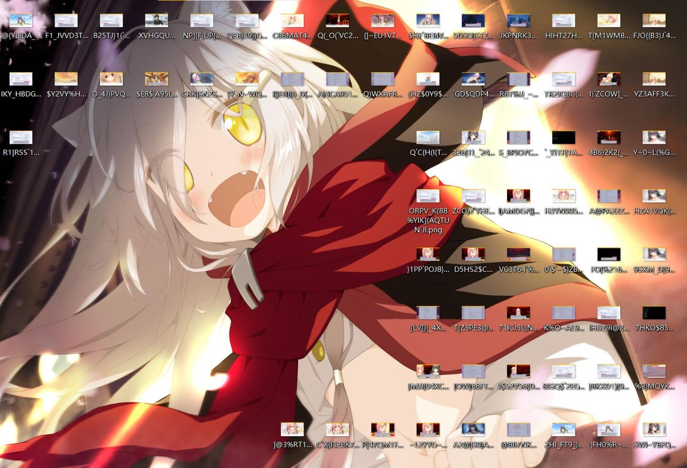（边打边截的图。。。我知道回不去）

但是，即使是在如此的状态下，我的心里还是试试刻刻想着葵

**为了你的一声“——喜欢你。”**

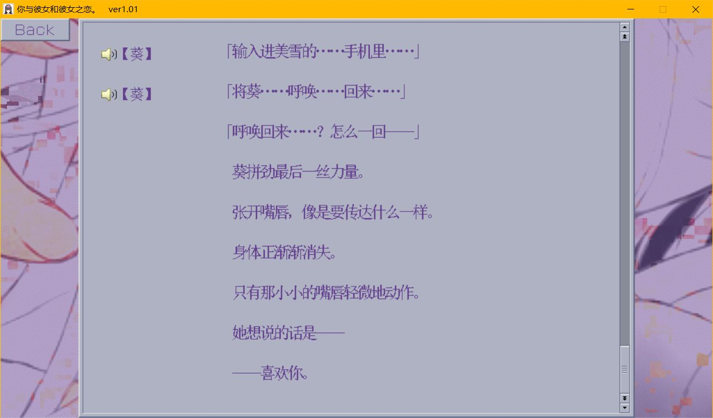

**这就是我与葵的恋爱——我与彼女之恋**

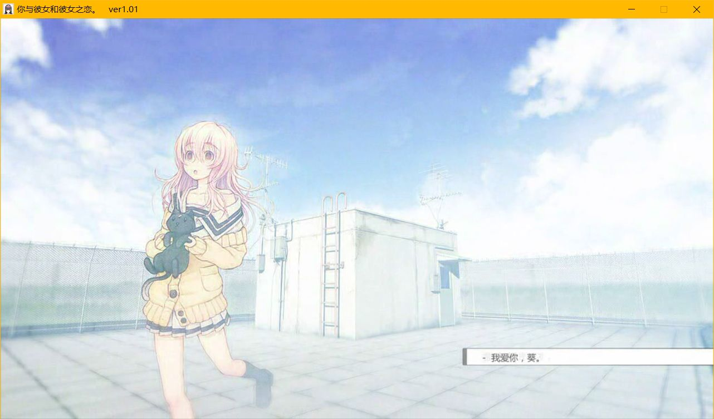

### **-我爱你，葵。**

### **Dark Blue**

三年前令我未能释怀的游戏，如今作为纯爱战士的我，在牛哥之中层层穿梭，在数不清的坏结局中寻出了唯一的圆满！

  

**我非常高兴！**

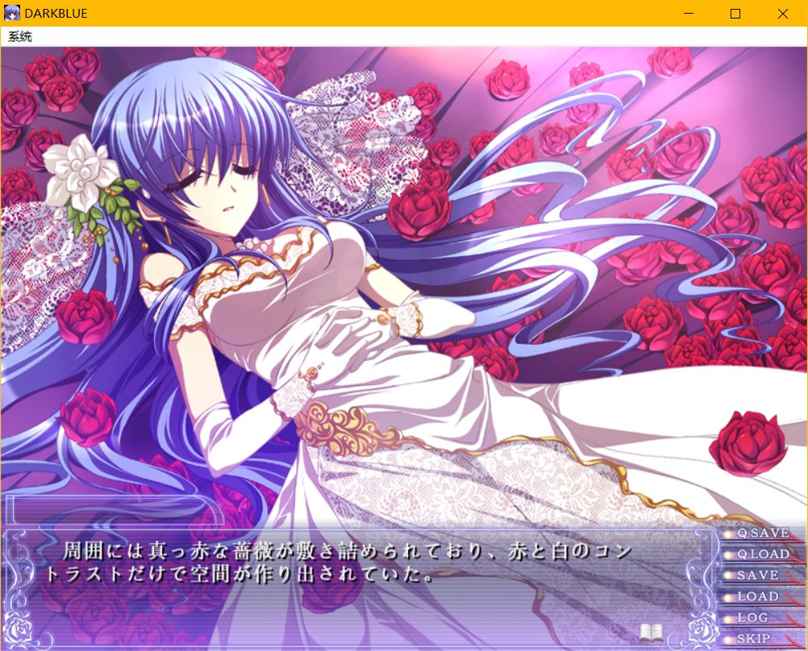

### **音羽，这一次，我没有失去你！**

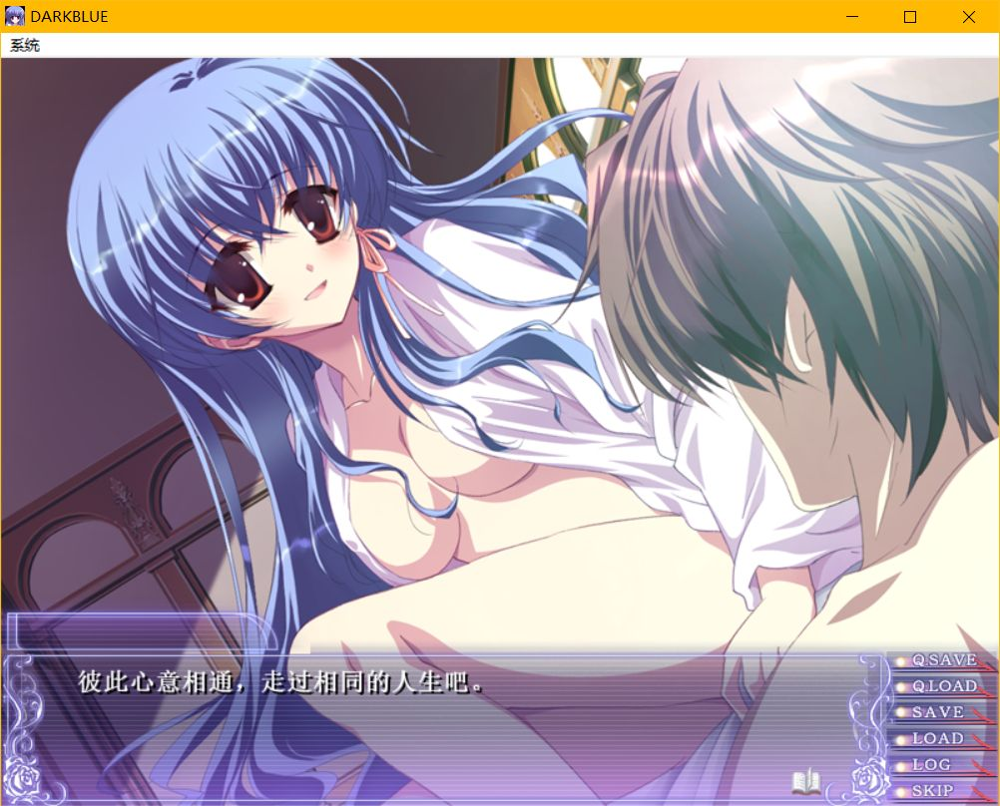

  
笔落于此，个人还是非常感慨的

推游戏经历了连续很多天各种游戏黑暗要素的洗礼，现在来看整个人的精神状态是不好的，看来和三年前一样，打完十二神器的我认识到了最重要的问题

#### 那就是**我打游戏的原则就是：**

### 果然还是可爱的萌妹子赛高！NTRbiss！！！

让我们赶快来看一点可爱的萌妹子缓解情绪

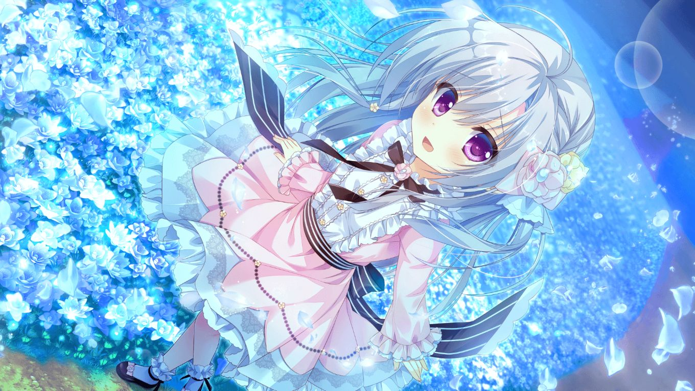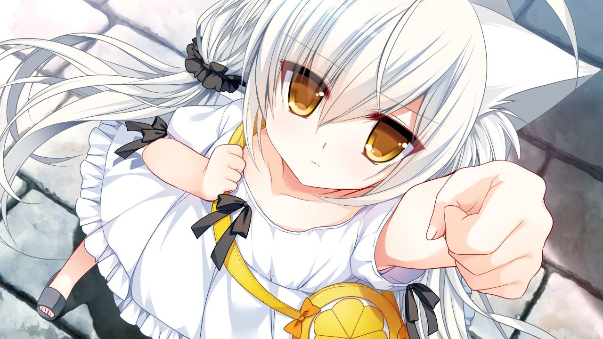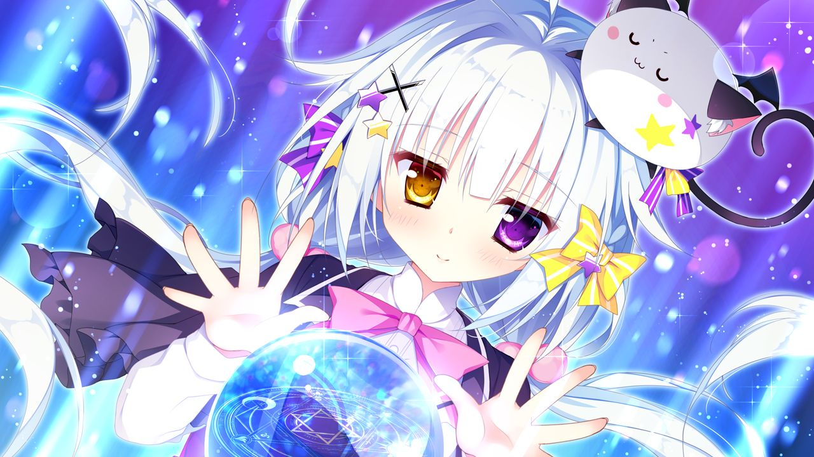

最后的最后，**仅代表我个人的观点**对十二神器的某些方面做出排名：

十二神器中最真实的恋爱——君与彼女与彼女之恋

十二神器中最NTR的游戏——Dark Blue

十二神器中最不值得玩的游戏——重生萝莉岛

十二神器中最摸不着头脑的游戏——素晴日

十二神器中最猎奇的游戏——3days

十二神器中最令人不舒服的游戏——euphoria

十二神器中最虐待妹妹的游戏——妹调教日记

十二神器中最意想不到的游戏——电波消逝之日

十二神器中最无聊的游戏——女装山脉

十二神器中最恶心的男主——是谁杀了知更鸟

十二神器中最意想不到的女人——媚肉之香

十二神器中最无可奈何的恋爱——沙耶之歌

以上就是十二神器的全部介绍和个人所感，谢谢各位朋友们看到了最后。

## 完结留念