# 萌新向：你爷爷奶奶都能上手的手机galgame游玩教程

 

> bilibili 同步转载: https://www.bilibili.com/read/cv26600785/

### 前提条件

- 你认识字，看得懂中文
- 手还能动，人还活着
- 能够操作手机（例如滑动，返回，点击），并且有一部安卓手机
- （苹果手机安装 `xp3player` 和 `ons` 模拟器）苹果这两个是要收费的，想白嫖自己 Google 找教程

如果参考教程后仍然失败可能是你手机太高级了，不是你人的问题应该是这样的 :doge

如果是这种情况咱推荐你别玩了，咱大可以不受这个气.

**本文提到的部分软件均可在站内 tools 下载**

本文提到的手机若无特殊说明为Android系统

## 一 、目录相关

这是手机的文件管理（不同手机图标不同哦）

文件管理
打开它你会发现有个叫手机存储的东西

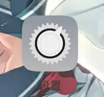

手机存储
这个东西打开之后我们就进入了/手机存储 这个目录

实际上这个目录其实是 `/storage/emulated/0` 这坨东西，为了方便记忆我们把它叫做/手机存储 

（讲这个东西主要是因为之前有人在手机存储里面创建了storage这个文件夹 然后在storage下面创建了emulated文件夹，然后又在emulqted下面创建了0。。。导致了他的游戏文件根本无法读取（笑死），简单理解就是这个b创建了 `/storage/emulated/0/storage/emulated/0/` 这么一坨东西，然后把游戏文件扔到这下面。。。）

## 二 、授予空间权限

一个小齿轮一样的图标，这个东西就是手机的设置（不同品牌手机设置长得不一样哦）

这里以国内某品牌为例

在设置中找到应用管理，找到你要授权的应用，选择应用权限，然后把需要的权限全部设置为允许

或者也可以在桌面找到要设置的应用，长按图标，选择详细信息然后点击应用权限，设置权限

## 三 、安装包相关

手机的软件是由一个个文件和文件夹组成的

手机的安装软件一般都是apk格式，极少数为apks或者apkm（这两种格式可以使用SAI进行安装，由于这两种格式比较少用到就不再多说）

如图所示：
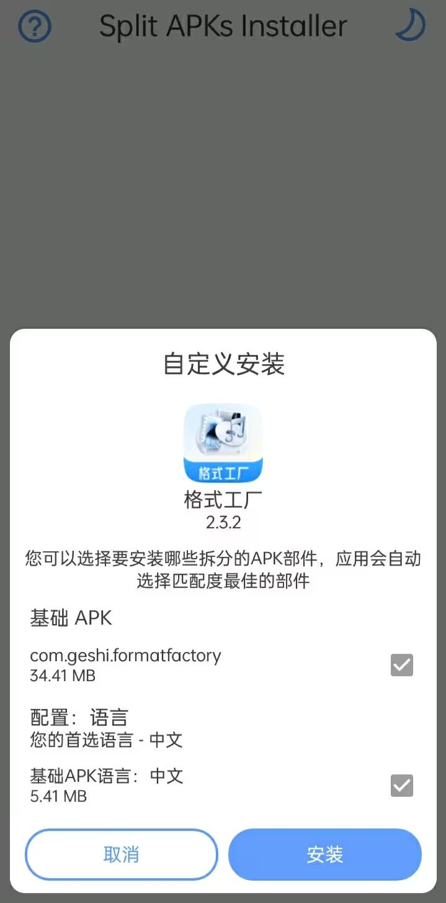

SAI安装apks示例
软件安装的实质其实可以理解为把apk文件解压到 `/data/app/软件包名` 这个目录下，然后创建一个类似快捷方式的东西（软件包名可以理解为软件的身份证，用来区分你是哪个软件，但实际上软件安装没那么简单，想深入了解请自行Google：手机软件的安装原理）

如果你有root权限的话千万不要尝试强制安装

因为实际安装步骤不仅仅是解压那么简单

（不过你大概率应该不会犯这样的错误，因为国产手机大多都没有自带root）
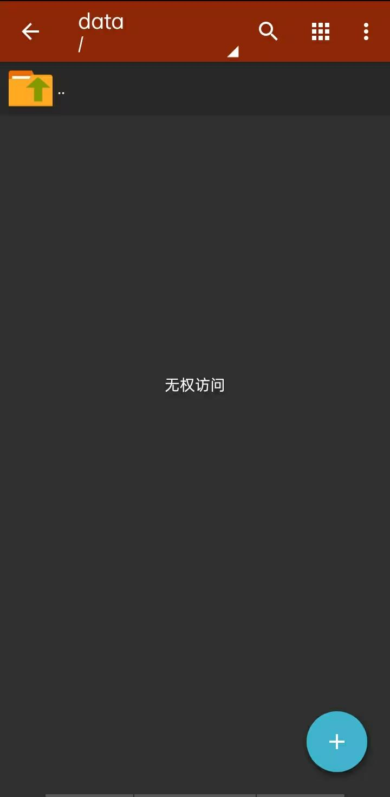

没root的屑

附1：关于QQ下载apk文件变成了 `apk.1`

请自行到 `/手机储存/Android/data/com.tencent.mobileqq/Tencent/QQfile_recv/` 找到你需要安装的文件，修改后缀名为 `apk`

（不要有人告诉我你连后缀名是什么都不知道）

附2：如果下载下来文件不是apk是apks，apkm或者其他格式，千万别乱改后缀（比如改成apk并尝试安装）如果是 `apks` 或者 `apkm` 请自行使用 **SAI安装** ，如果是其他格式，请确认你的文件是否为手机安装包，如果是请检查有没有`readme.txt`或者你去资源来源找安装方法！！！

> 附1：关于QQ下载apk文件变成了apk.1 
>  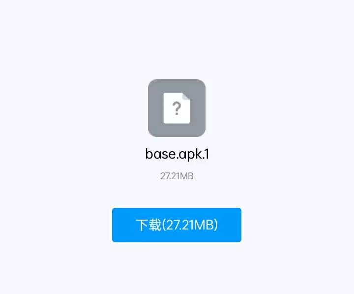

## 四 、解压缩相关

特别提醒，手机解压文件都是免费的

千万别被骗了

> 这里推荐的解压软件是 `ZArchiver`

不过毕竟只是推荐，如果你下载资源的地方有标注要使用哪个软件解压尽量就用哪个

（不然可能会出现解压后文件编码不正确，文件损坏等等）

压缩其实就是把许许多多的文件夹合并成一个文件，方便传输。

常见的压缩格式有：`.tar、.gz、.tar.gz、.tgz、.bz2、.tar.bz2、. Z、.tar.Z、.zip、.rar、.7z、.lz4` 等

（毕竟比起下一堆文件并且之后还要手动创文件夹，下载压缩包会更省时间）

分卷压缩实际上就是源文件太大了，把这些文件压成几份方便传输（也有可能是因为网盘有单个文件传输限制），所以分卷的东西一定要全部下载！！！

下载完之后直接用解压软件解压即可（ `.zip.7z`或者`.zip.lz4`这种嵌套格式要解压两次哦，千万别乱改后缀）如果是分卷压缩直接解压`.part1.xxx`或者`.001.xxx`（xxx为压缩格式，例如`zip`）（有些也可能是`xxx.001`或者`xxx.part1` ）即可，不过需要注意的是，分卷压缩的文件要处于同一个文件夹！！！

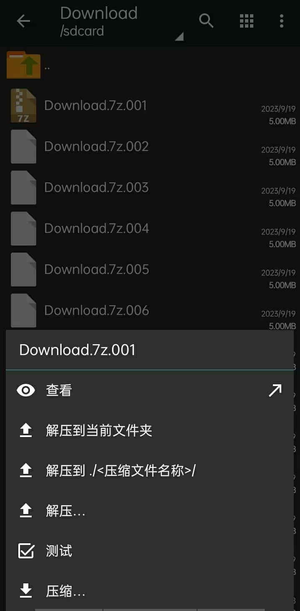

解压分卷只需要解压第一个就可以了
关于解压密码：

不要找我！你哪里下的就回哪里找去！！！

## 六 、补充

#### 1.

目前手机一般来说常见的cpu架构有7种，分别是：`armeabi、armeabi-v7a、arm64-v8a、x86、x86_x64、mips、mips64`，手机的cpu的架构可以在安兔兔查看

注：大多数手机cpu不止支持一种架构

而部分安装包只支持特定的几种架构，如果软件安装不了可能是你cpu不支持，建议更换其他版本

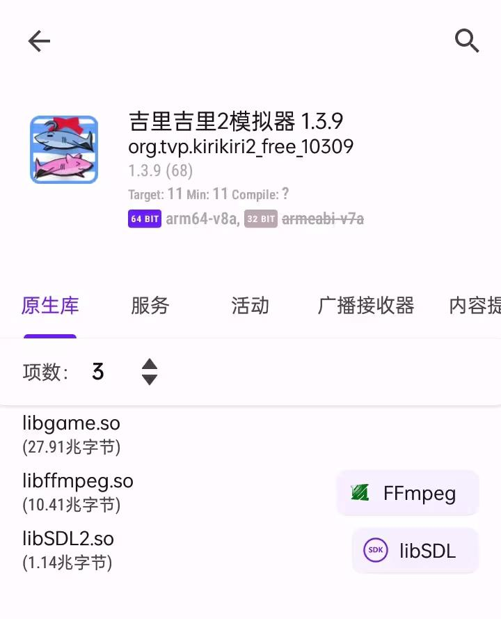

`LibChecker`可以查看安装软件的信息哦

#### 2.关于提示此软件为旧版Android开发

如果运行的了直接忽略

如果闪退更换版本

（建议bing找适合你的版本，如果到下载站下载请勿选择安全下载<软件管家预定>）

#### 3.关于下载速度过慢

如果是度盘建议使用直链

至于其他的，可能是你网络问题，建议挂加速器或者修改dns试试<也有可能是网站限速，这个真的没办法>

（bing有教程的，不要什么都没查就来问别人，实在听不懂咱开个会员好不好，或者大不了咱别玩了，别受这个气）

看到这里，相必你一定有了亿点点基础了吧

那么我们直接进入正题罢

目前，在手机上要玩galgame的话常见的一共有7种，分别是`krkr`模拟器，`ons`模拟器，`mine`模拟器，`joi`模拟器以及`exagear`模拟器，`winlator`模拟器，`box64droid`模拟器。

其中`exagear`模拟器，`winlator`模拟器和`box64droid`模拟器是可以直接运行电脑的文件的，不过就是比较吃性能，因此这三种模拟器不介绍了（毕竟我手机性能比较垃圾），感兴趣的小伙伴可以在bing或者哔哩哔哩查找相关教程哦，至于joi模拟器（一般用于rpg游戏）我个人用的也很少就不展开说了。

## Q&A环节参考🌸

原文链接已不可考

### krkr模拟器：

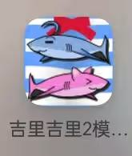

该软件能运行绝大多数主流galgame

并且使用这个软件使用起来非常简单，你只需要打开软件找到你资源所在目录运行下面的data.xp3即可

 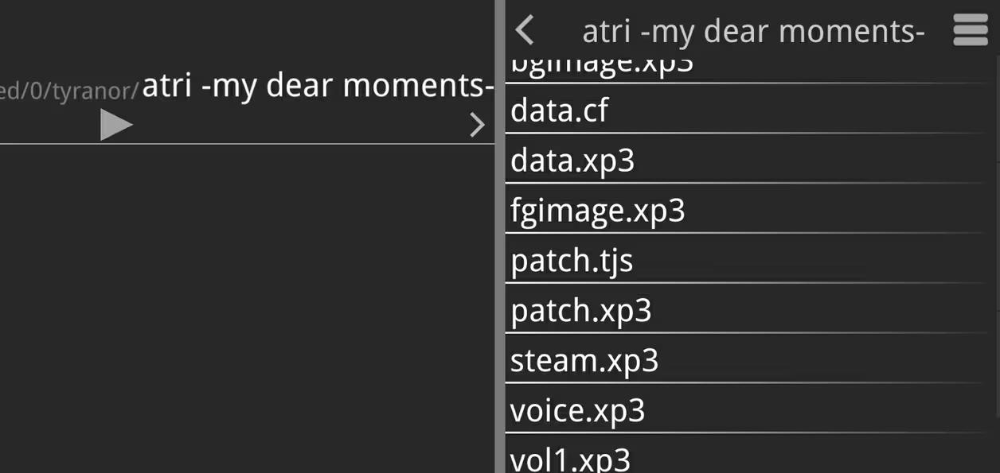

运行图中的`data.xp3`
如果`data.xp3`运行失败就把所有文件都点一遍

如果还不行的话看看你文件夹下面有没有dll文件，如果有你大概率下成了电脑资源，建议换资源，实在没有资源建议换模拟器

（记得好像krkr不能使用dll，如有错误请指正）

如果文件目录下面没有.xp3文件那就是这个资源不能用krkr模拟器打开，请自行更换模拟器

Q1：游玩一段时间后闪退报错`invalid object context`

A1：剧情快进，在快到闪退的剧情点跳过该段剧情。如系统默认不能跳过未读内容，点击游戏内部的设置（config），将掠过文字由只有已读改成全部。

Q2:点击运行游戏弹出或报错里出现`Cannot find storage ：//data…(省略中间一段）==/base.apk`

A2: 请更新模拟器版本至1.3.9及以上

Q3：推剧情中报错中出现`Script exception raised Label…`(忽略）或者弹出`information `

A3:请移出汉化补丁（`patch.ks/patch.xp3`），跳过故障点剧情后移回来，记得存档

Q4：报错中出现无法转换字符为宽字符，可能数据被加密或损坏，也可能是使用了错误的文本编码

A4:该问题分多种情况，解决方法请依次尝试：

去补丁库中找`xp3filter.tjs`或者`patch.tjs`（即补丁）并下载到游戏文件夹内

在`patch.tjs`里写`Plugins.link(“kirikiroid2.dll”);Storages.setTextEncoding(“gbk”);`

可能是多了一个xp3filter.tjs，删掉该补丁。

Q5:出现卡顿现象以及立绘缺失现象

A5:卡顿请点击右上角—点击全局设置—找到图形渲染器—将软件渲染器修改为OpenGL（试验性）。立绘缺失一般是由于缺少补丁patch.tjs，下载对应的补丁并放到游戏文件夹即可。

Q6：出现无法存档，打不开存档或者报错中出现bmp尾缀

A6:关闭游戏，删除`savedata`文件夹，重新打开游戏，点击存档，新建一个档。如果原先有旧档不舍得，请先备份。

Q7：报错发现只读的外部存储器

A7：游戏移出SD卡，或寻找正确的文件夹放进去

Q8：图片，音频，视频缺失

A8:随便找个同类型的文件，重命名为缺失文件的名字，无损压缩，重命名成patch.xp3。存档图片同理，区别是把重命名后的图片放到savedata文件夹里

Q9：看回想时报错，或者报错出现Not support media type

A9:打开patch.tjs（没有该文件就建一个），在最后一行添加System.setArgument（“-debugwin”.“no”）

Q10：报错中出现does not exist或者点击save就闪退

A10:缺补丁，下载对应的补丁patch.tjs后放到游戏根目录即可，对于iOS的xp3plyer，需inbox中的文件拉出inbox文件夹，后点击解压缩并解压文件

### ty模拟器：

该模拟器能运行绝大多数krkr上能跑的并且可以运行绝大多数krkr上面不兼容的，以及其他一些类型的galgame，我愿称其究极缝合怪

（可惜跑不了ons，不然基本上万能）

 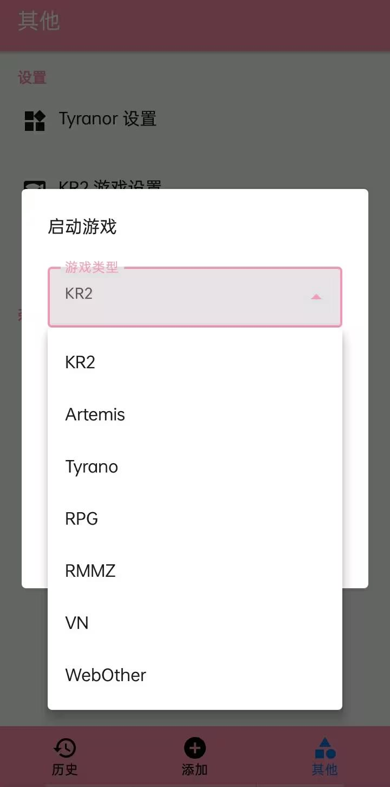

tyranor可以支持的galgame
tyranor模拟器的话，你只想要将你的资源塞到/手机存储/tyranor 这个目录就可以了（记得解压！！！）接着重新打开软件就可以看到游戏了

（没看到要么不支持，要么你没给文件访问权限）

Q1:出现闪退

A1：1.拟器点击右上角“设置”按钮在常用设置里把Root启动关闭。然后点击“高级模式”找到显卡渲染模式。如果是极速模式就把它改成兼容模式。如果是兼容模式就把它改成极速模式，最后点击“保存设置”并重启模拟器。2.检查资源解压是否完整。3.可能是版本过低，也可能是暂不支持该机型

Q2：点开游戏出现黑屏

A2：请将除了root.pfs的文件全部删掉，然后再启动模拟器打开，这时会弹出提示是否自动打补丁，选择否。

Q3：打开模拟器后找不到游戏

A3：请将解压后的游戏放置到文件夹【Tyranor】，如若没有请先自行创建一个。点击右上角弹出选择路径的提示，选择刚创建的【Tyranor】文件夹，点击确认。注意要检查访问权限，可在【其他】内找到检查权限功能

Q4：点击更新但无反应

A4：分两种情况，由于【ty】模拟器的更新不会弹出进度，可能是由于更新速度慢，请耐心等待一段时间。如上述情况未得到解决，请上网安装旧版本的【ty】模拟器，执行更新操作。由于不是每个旧版本都能成功，请重复上述操作直至成功。

### ons模拟器：

ons模拟器
 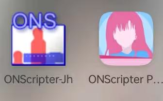

ons模拟器种类很多，我目前已知的有6种

不过基本上都差不多

解压完文件后直接找到对应目录打开即可

 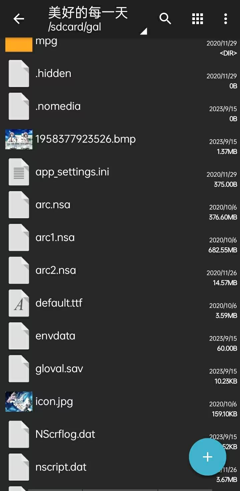

解压好的文件
用ons模拟器打开到这个目录的上级目录

你会发现ons会直接把这个识别成文件而不是文件夹

所以直接点开就可以玩了

 

对比图
注：图中atri为krkr资源，该图片仅对比

请勿使用ons模拟器打开krkr资源

（不过好像也没什么事）

Q1：为什么存档消失了/无法读取存档

A1：1.可能是误删了相册内的游戏图，如果已删除则暂无补救方案。

2.游戏放置地方不对，请放内置卡或者破解外置卡权限或者用Ons-jh并勾选换位存档。如果还是不行，请在游戏剧情任意位置存档，之后把存档文件放到手机游戏文件的相同位置

Q2：点击启动游戏出现闪退/游玩过程中闪退，黑屏等情况

A2：分多钟解决方案：

1. 更换或更新模拟器。
2. 查看游戏路径是否规范，

例子：`ons/万华镜五 ons版/【arc.nsa/0.txt/.dat/default.ttf…(后面忽略)】`该格式正确。

`ons/【arc.nsa/0.txt/.dat/default.ttf…(后面忽略)】`←错误，少套一层文件   

`ons/万华镜/万华镜五 ons版/【arc.nsa/0.txt/.dat/default.ttf…(后面忽略)】`←错误，多套一层文件

3. 在`key`文件夹下（部分游戏有）创建`oa.key`文件夹 
4. iOS用户在更新完iOS15后会出现无法打开游戏的情况，该问题目前暂无解决方法
5. 可能是解压问题导致缺文件：检查游戏文件是否包含`arc.nsa`(媒体文件)，`default.ttf`(字体文件)，`.txt/nscript.dat/.nt2/.nt3/`(脚本，其一)，三者缺一不可（注意：含有`nscript.dat.nt3`的游戏需使用【MiNE】模拟器，`ons-jh`不支持nt3脚本）
6. 可以打上`onsplus`补丁用于切换至EN版
7. 快进的方式跳过bug，但请记得存档
8. （需root）

放置游戏文件夹在副存储的`Android/data/目录`中，以下是包名：

`MiNE` 为 `cn.natdon.onscripterv2`

`ONScripter-GBK` 为 `cn.natdon.onscripterhd`

`Onscripter-Jh` 为 `com.jh.onscripter`

9. 安卓系统版本过高，兼容性问题
10. 设备的时间调前个几年（证书过期时使用）
11. 游戏文件内混入其他文件，例如模拟器的安装包，删除其他文件
12. 将游戏移至电脑并用ons电脑版运行，直到过了出现bug的剧情点，存档后移回手机

Q3：游戏无法全屏/出现黑边

A3：分多钟解决方案：

1. 向游戏根目录里加ons.wide文件

2. 如果方法一无用，请先删除ons.wide文件。修改00.txt第一行的内容：将;mode800,value2000改为;$S800,450（注意分号）

Q4：【ONS】模拟器导入了游戏但是找不到文件夹

A4：【ONS】模拟器无法识别夹层文件夹进入游戏文件夹，点击进入，直到解压专家界面中文件夹名下显示 ”X 项“（X代表大于1的数字），来到最内层的文件夹，长按该文件夹，选择隔空投送——分享—其他应用，在弹出的窗口中，选择存储到文件—我的iPhone—ONSPlayer，然后点击右上角的存储

游戏资源要放入模拟器同名的文件夹中，如【MiNE】模拟器需要把游戏复制到Mine文档中才能玩

Q5：报错出现`default.ttfis` missing或发现`default.ttf`文件缺失

A5：可将其他ons游戏的default.ttf文件移入或网上下载后移入，该文件（字体文件）为ons游戏内通用文件，因此其他游戏的也可用。

### MINE模拟器：

MINE模拟器
这个模拟器和ty类似，你只需把资源文件移到/手机存储/MINE 这个文件夹下

Q1：报错提示找不到文件

A1：与【ONS】模拟器的一个区别是，【MiNE】模拟器在识别游戏时必须保证只有一层文件夹才能被识别。请删除多余的外套文件夹。

Q2*：点游戏进去后显示缺少.tff字体文件并发生闪退

A2*：【ONS】模拟器篇已给出解决方案，只说明一个特殊情况：当报错.tff或.txt文件不存在，但发现资源内存在.tff或.txt文件时，请移走游戏内的.tff或.txt文件（因为理论上【MiNE】模拟器不需要.tff文件与.txt）2.第二种可能是在【ONS】文件夹与游戏文件夹之间有子文件夹，导致读取不到。将游戏文件移动到【ONS】文件夹下面即可

Q3：报错提示无法打开目录

A3：
1. 没有给访问权限，请去设置处给模拟器开权限并重启手机
2. 模拟器与系统不匹配（系统版本过高或模拟器版本过低等情况）

Q4：报错找不到以下文件（提示缺少不止一类文件）

A4：大概率是解压错误和资源问题，请及时更换资源

Q5：带有op的游戏运行时会发生闪退

A5：把视频删掉就可以进了

模拟器就介绍到这里，不过有了模拟器还不够，我们还需要游戏的资源文件

（模拟器只是在你的手机上模拟一个能运行这种类型游戏的环境，可是你只有环境还不够，你还得要游戏啊）

游戏的资源文件一般在贴吧，哔哩哔哩或者一些资源网站都可以找到，如果你不知道要找什么请移步知乎！！！

### 关于安卓直装：
这种资源顾名思义就是安卓上面直接就能装的不用什么模拟器啊这些东西，装了就可以打开

 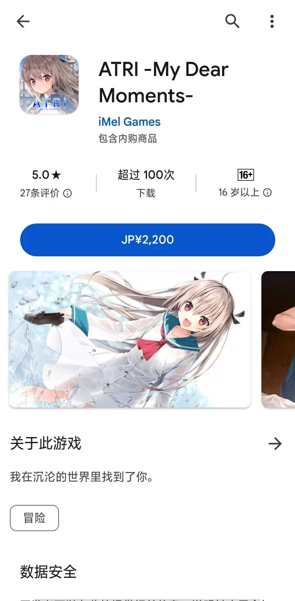
不过这个东西缺点也是有的，毕竟有可能你这个cpu不支持这个版本，局限性比较大，而且不好打补丁（不过绝大多数直装都是已经打好补丁的）
直装分为官方和移植（绝大多数都是移植，官方很少）
官方大多数都要花钱，不过在Google Play就可以下载，还是比较方便的

 
atri 🤤🤤🤤 可爱捏
移植的绝大多数可以白嫖（看你资源的渠道多不多了）

那么本篇文章就到此结束了，感谢各位的观看，如果还不明白或者想要找资源欢迎加我`QQ386297498`（让我看看是什么生物）
