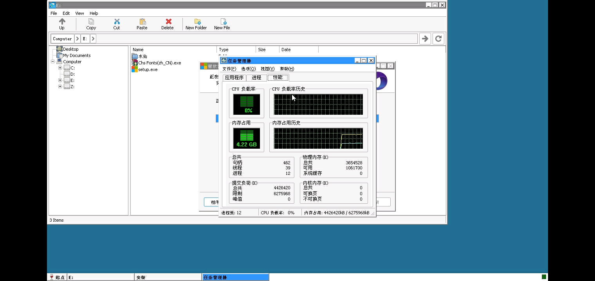
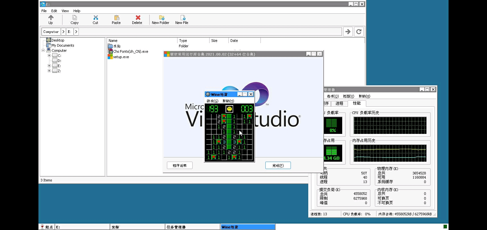

# 手机游玩 galgame 模拟器的终极解决方案: winlator

> 原文链接：https://www.bilibili.com/read/cv27368804

## winlator是一款能在手机上点开exe电脑版galgame的开源软件

大部分情况下我们可以很轻松的在网络上找到galgame的移植版本（例如`ons`，`krkr`，`artemis`等），这些版本一般都是由pc移植而来。但少数情况下我们很难找到或者根本找不到某个游戏的移植版本或者直装版本，而你特别特别想玩这款游戏，又懒得打开电脑，或者说不方便使用电脑的情况下，那么我们可以就可以使用winlator。

---

> winlator模拟器，即一款可以在手机上运行桌面应用程序（Windows x86_64）的模拟器，其原理是利用 Wine 和Box86/Box64 这两个东东（感兴趣自行了解，这里不再阐述）

---

首先我们需要准备我们想玩游戏的pc版本，以及如下文件：

> Chs Fonts(zh_CN).exe：修复部分字体用的
> main.1.com.winlator.obb：obb数据包
> setup.exe：微软运行库
> Winlator_1.0.apk：winlator安装包

所有相关文件请进入**首页**的 simulator(模拟器) 内下载

# Step 1：下载并安装 winlator 应用程序

下载apk直接安装，这里不过多说明。

# Step 2：运行并加载obb数据包

安装完winlator后我们直接打开

这里会提示我们授予存储空间权限，我们直接允许
接着程序会直接退出，然后在`/手机存储/Android/obb`创建一个文件夹，如图所示：

我们只需要把下载好的obb数据包复制过去即可

然后我们重新打开程序，此时会提示正在安装obb映像

此处可以会比较久，耐心等待一会
然后就会变成这样

# Step 3：创建容器

我们点击左上角加号新建一个容器
如果没有特殊需求默认即可
以下是我的配置仅供参考

> 关于显卡驱动：
> Vrigl兼容性会比较好一点
> Turnip+Zink速度快
> 所以如果是旧手机建议选Turnip+Zink

> 关于DX以及d3d默认值：
> WineD3D，由wine官方团队编写，用于将DX9/DX10/DX11调用转换为OpenGL，所以不适合3D游戏。
> DXVK，由爱好者编写，V社参与维护，用于将DX9/10/11调用转换为Vulkan，3D游戏建议用这个。

关于处理器核心开关，我的建议是能勾就勾

接着我们选择驱动器再点击选择添加驱动器

打开游戏目录点选择（记得把我们下载的文件复制过去）

然后就可以点击下方的勾勾创建了

# Step 4：启动容器并配置

> winlator的操作逻辑有点像Windows官方远程桌面的指针操控，但又不完全一样
> 滑动控制鼠标
> 单指点击是左键
> 双指点击是右键
> 单指按住另一只手指滑动是拖动

我们接下来直接点击运行

如图

首次启动会非常非常慢，耐心等待即可

如果看见这样的弹窗，直接选择安装即可

安装后过一会就可以进入桌面了

接着我们进入前面设置好的目录（此处为E盘）

分别运行我们的两个文件

第二个文件安装的有点久
如果你想查看资源使用情况可以打开任务管理器

如果你实在过于无聊可以打开扫雷

在玩了不知道多少把扫雷之后，我们终于结束了安装

至此我们就可以打开我们的游戏了

# Step 5：（非必须）按键映射

按键映射在输入控制这里，自行根据习惯配置

容器中按手机上的返回按键（可能非实体按键，看手机型号），选择控制模式就可以调出我们映射的按键。（由于每个人习惯不同，这里不多阐述）

Ciallo～(∠·ω< )⌒★